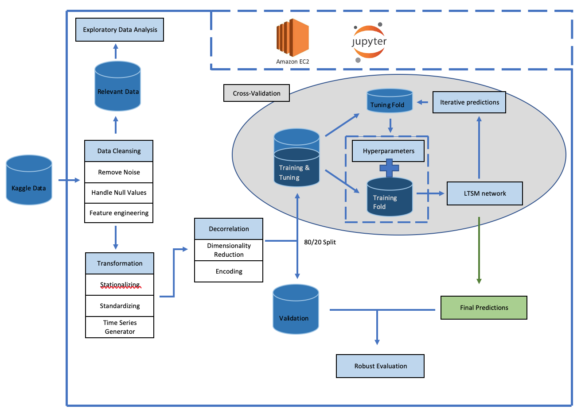

# Predict Future Sales  
--- 
### Overview
Harnessing the power of machine learning this project offers retail stores a more efficient solution to their supply chain by identifying future sales of inventory. Allowing retailers to act preemptively and avoid negative effects from a bull whip along the supply chain.  

---  
___Pipeline___  
  

- Remove Autocorrelation
  - Stationarity
- Standardize
  - RobustScaler
  - Normalizer
- Decorrelate
  - PCA
  - Auto Encoder
- Singular Value Decomposition
  - Time Series Generator
- Training Models  
  - Random Forest
  - LSTM Deep learning
 

---
### Summary
1. Purpose, motivation and description: 
> ...
2. Data acquisition:  
> ...
3. Data management:  
4. Data cleaning:  
5. Exploratory Data Analysis:  
6. Feature Selection:  
7. Modeling:  
8. Evaluation:  
9. Communicating Findings: 
10. Conclusion and Summary:  

